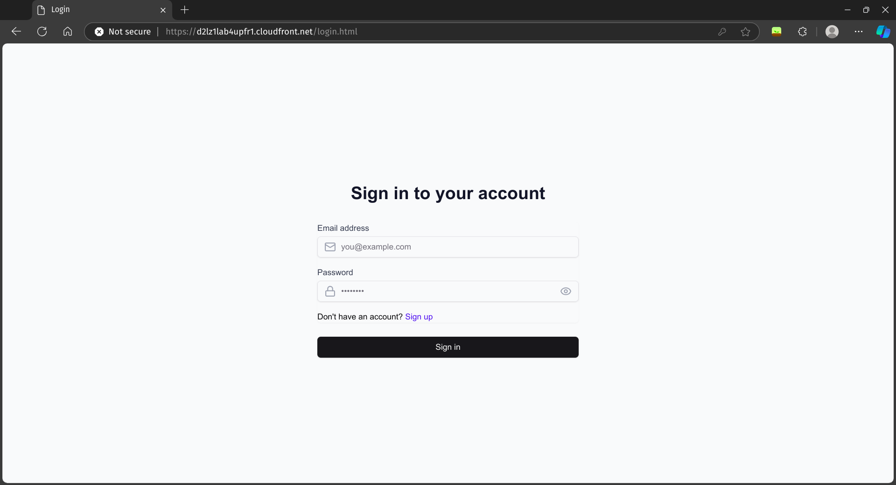
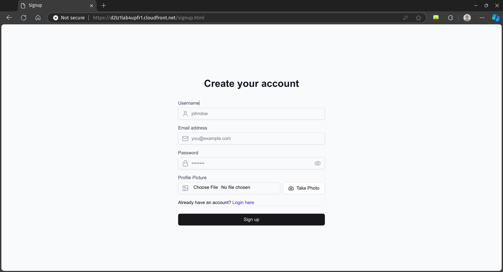
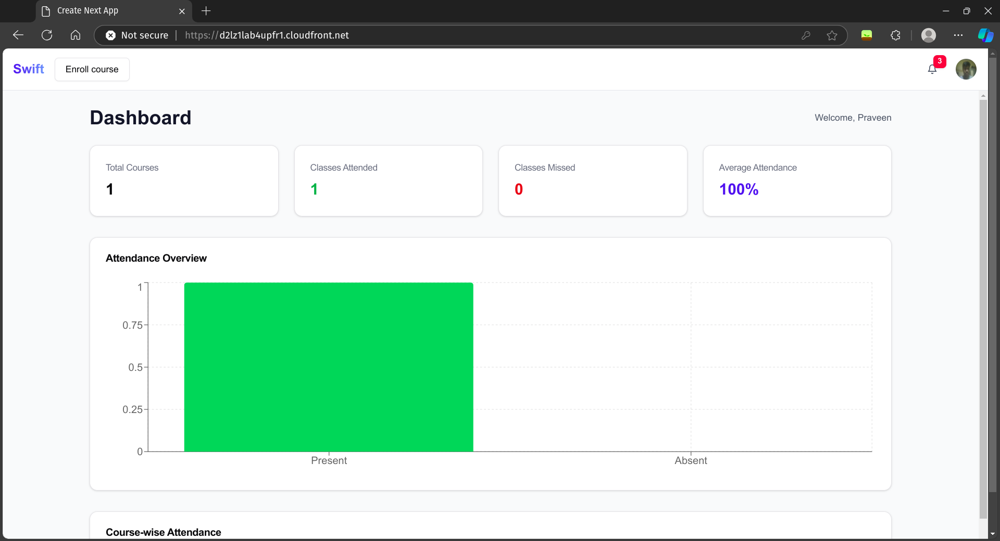
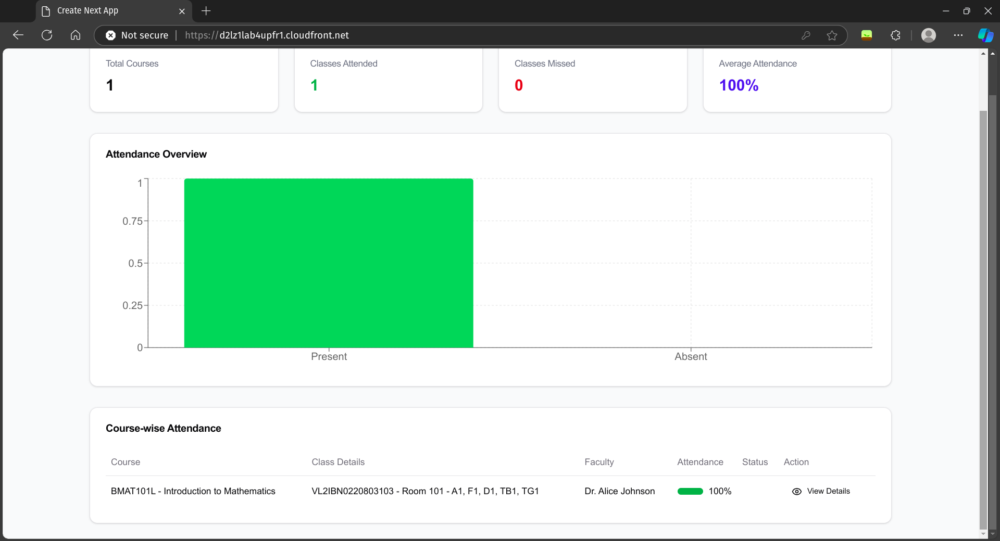
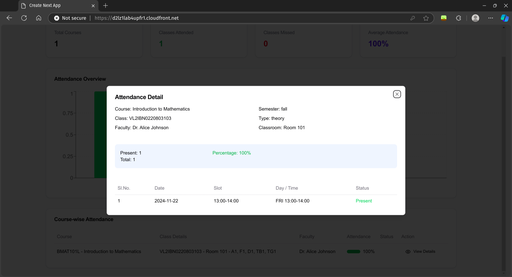
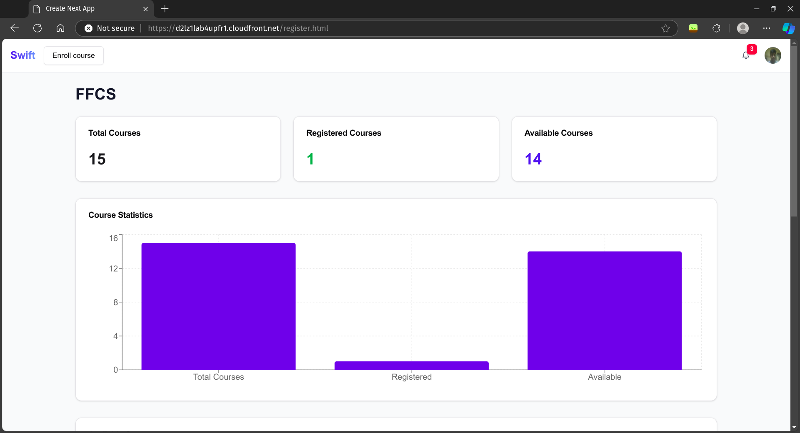
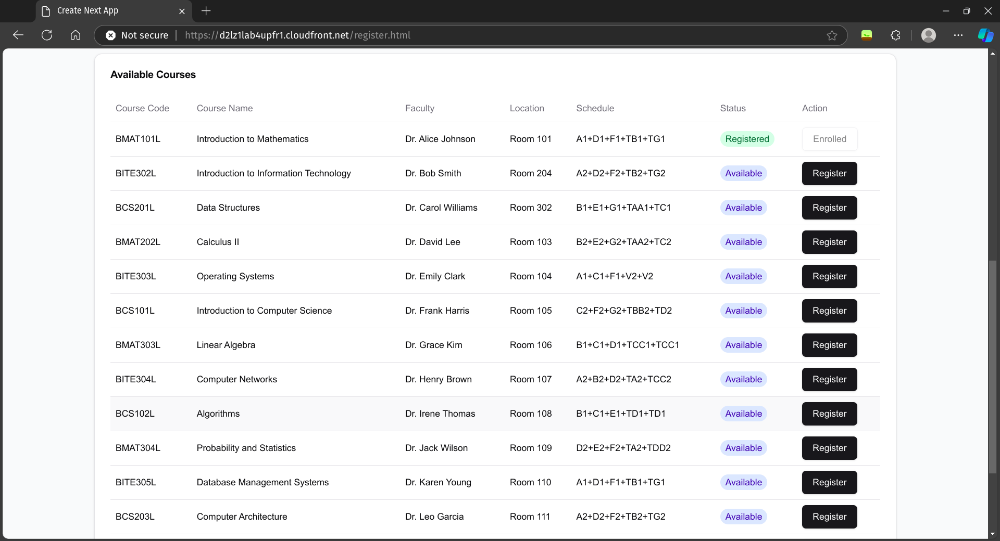
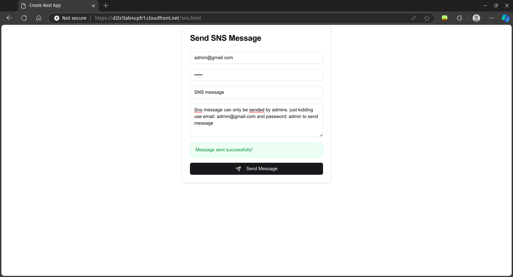
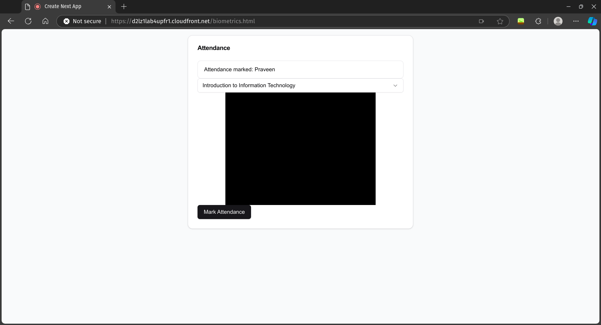
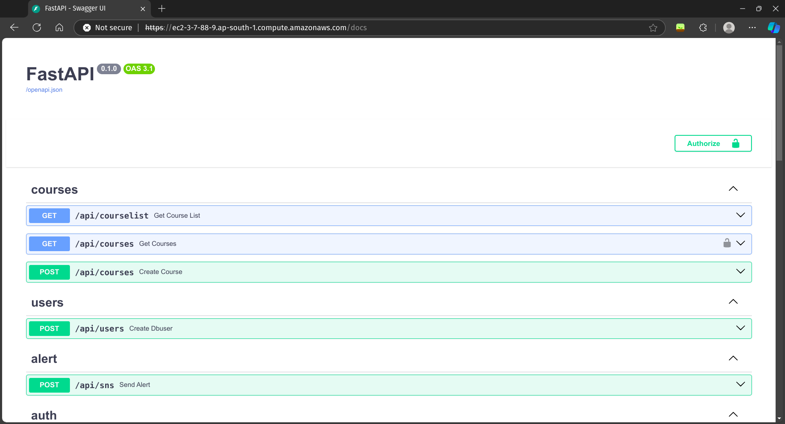

# Swift

This repository hosts a **Simple Automated Attendance Management System** , leveraging **AWS services** for deployment and functionality.

## 🚀 Features
- **Frontend**: Built with **Next.js**, deployed via **Amazon S3**, and distributed with **CloudFront**.
- **Backend**: 
  - **Face Recognition** powered by **AWS Rekognition**.
  - **Database** managed using **Amazon RDS**.
  - **Messaging System** implemented with **AWS SNS**.
  - Built with **FastAPI**, served with **Uvicorn**, and configured with **NGINX** for reverse proxy.
- **Infrastructure**: Hosted on an **AWS EC2 instance** with an **Elastic IP Address**.

---
## Screen shots

<p float="left">
  
  
</p>

<details>
  <summary>Click to expand more screenshots</summary>

  <p float="left">
    
    
  </p>

  <p float="left">
    
    
  </p>

  <p float="left">
    
    
  </p>

  <p float="left">
    
    
  </p>

</details>

## 📂 Project Structure
### Frontend
- Framework: **Next.js**
- Deployment:
  - **S3** for static site hosting.
  - **CloudFront** for content distribution.
- Build Commands:
  ```bash
  pnpm install
  pnpm run build
  ```
- Upload the `build` output to the **S3 bucket** and configure **CloudFront** for access.

### Backend
- Framework: **FastAPI** with **Uvicorn** server.
- Services:
  - **AWS Rekognition** for face detection.
  - **AWS RDS** for database storage.
  - **AWS SNS** for message publishing.
- Reverse Proxy: **NGINX**.
- Deployment:
  - Clone the repository into an **EC2 instance**.
  - Start the server using the provided script:
    ```bash
    bash start.sh
    ```
---

## 🛠️ Usage Instructions

### Frontend Setup
1. Clone the repository:
    ```bash
    git clone <repository-url>
    cd frontend
    ```
2. Install dependencies and build the project:
    ```bash
    pnpm install
    pnpm run build
    ```
3. Upload the `build` folder to your **S3 bucket**.
4. Configure **CloudFront** for content distribution.

### Backend Setup
1. SSH into your **AWS EC2 instance**.
2. Clone the repository:
    ```bash
    git clone <repository-url>
    cd backend
    ```
3. Start the backend server:
    ```bash
    bash start.sh
    ```
4. Ensure **NGINX** is configured as a reverse proxy, pointing to the **Uvicorn** server.

---

## 🔧 AWS Configuration
1. **Amazon RDS**:
   - Set up a relational database instance.
   - Update the connection details in the backend configuration.
2. **AWS Rekognition**:
   - Create a collection for face recognition.
   - Ensure your backend has the necessary IAM permissions.
3. **AWS SNS**:
   - Set up an SNS topic for notifications.
   - Integrate the ARN into the backend.

---

## 📘 Documentation
- **Frontend**: 
  - Hosted via **S3** with distribution by **CloudFront**.
  - Accessible via the configured **CloudFront URL**.
- **Backend**: 
  - Hosted on an **EC2 instance** with an **Elastic IP Address**.
  - Accessible through **NGINX** at the server's public IP or domain.

---

## 🧑‍💻 Contributing
1. Fork the repository.
2. Create a new branch:
   ```bash
   git checkout -b feature/your-feature
   ```
3. Commit your changes:
   ```bash
   git commit -m "Add your message here"
   ```
4. Push to the branch:
   ```bash
   git push origin feature/your-feature
   ```
5. Create a Pull Request.

---

## 📄 License
This project is licensed under the [MIT License](LICENSE).

---

Feel free to improve or extend the system! 😊